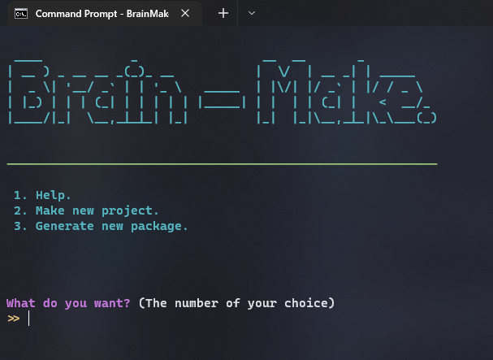

# **Compiler and CLI Tool**
The brain-rot compiler runs your brainrot code and compiles it while the CLI tool(which is called "Brain-Make") handles more advanced functions such as creating a quickly accessible project from template or creating a template of your own.

Usage guide below:

## <u>Compiler</u>
The compiler just compiles and runs your code.
You can use the compiler from your terminal by typing "brainrot" with the required arguments. 

Example :
```terminal
brainrot <filename.rot> <compiled_file_name> <autorun(y or n)>
```
The compiled_file_name should be passed without any extention and if there are spaces in your filename you should enclose your file name in dual quotes.

### <u>Compiler argument guide</u>
- `<filename>` :   The name of the file containing the code.

- `<compiled_file_name>` : The name that the compiled output file should be named

- `<autorun>` :  Desides if the file is automatically ran by the compiler or not.
**!! ONLY ACCEPTS "y" OR "n" INPUTS STANDING  FOR "yes" OR "no" !!.**

## <u>CLI Tool</u>
The CLI tool which is balled `Brain-Make` handles more advanced functionalities and it could just be ran by using the following command because it also has a interactive UI

```terminal
brainmake
```

after running this command you will have an interactive self explanatory user interface as below.


<br>
<br>
But if you want to get your work done a lot quicker you could use the CLI tool with passing it's default arguments.
<br>
<br>

```terminal
brainmake <-h, -i, -c>
```

### <u>CLI argument guide</u>
- `-h`, `--help`, `help` :    Displays help menue.

- `-i`, `--initialize`, `--init`, `initialize`, `init` : Make/Initialize new project.

- `-c`, `--convert`, `--conv`, `convert`, `conv` :  Generate your own template or package from written code.

<br>
<h5 align="right">© Official Brain-Rot Doucumentation.</h5>
<br>

#
# <center>_**The End of This Page**_</center>

#### <center align="right">[Next >>](./simple_start.md)</center>