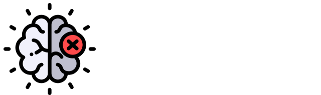

# **Brain-Rot**
Brain-rot is a programming language designed for creatures/living beings/organisms(species : _Homo-sapiens_) of the "gen Alpha" and late "gen Z" to match their unique vocabulary and unidentified phrases. 
(**_This is a meme project_**)

## About This Project.
When you see this project at first you might or might not 
have many questions about this project. These are few of 
the most asked questions about our project.

### 1. Why did you even built this ?
This language was built because I found the new vocabulary
and phrases used by the young kids these days.The words for
example :- skibidi, gyatt, ohoi, ect.. sounds funny but does
that even mean something? being the programmer I am I saw 
an massive incoming crisis and made a programming language
that those _poop heads_ could understand. 

### 2. What inspired you to do this ?
Honestly, except for the reason in question 1 a similar project from **[Infroid_Coder](https://github.com/Infroid-Coder)** where he made a programming language named **[Peththa Script](https://github.com/Infroid-Coder/PeththaScript)** is what inspired me most.

### 3. Compiled or Interprited language ?
This language is neither a compiled nor an interpreted language. this language is what i would call a I-C-C-I language. ICCI stands for Interprit-Convert-Compile-Interprit.

## Important Links.
[`Documentation`](./Docs/intro.md)

[`Download`](https://github.com/Ashen-Dulmina/Brain-Rot)

[`External Credits`](./Docs/external_credits.md)

## Special Thanks And Credits
**[Infroid_Coder](https://github.com/Infroid-Coder)** - For the support on syntax suggession.

**[Oshan-Dilmina](https://github.com/Oshan-Dilmina)** - For addressing major bugs and writing the VScode extention to make it easier to code in brainrot.